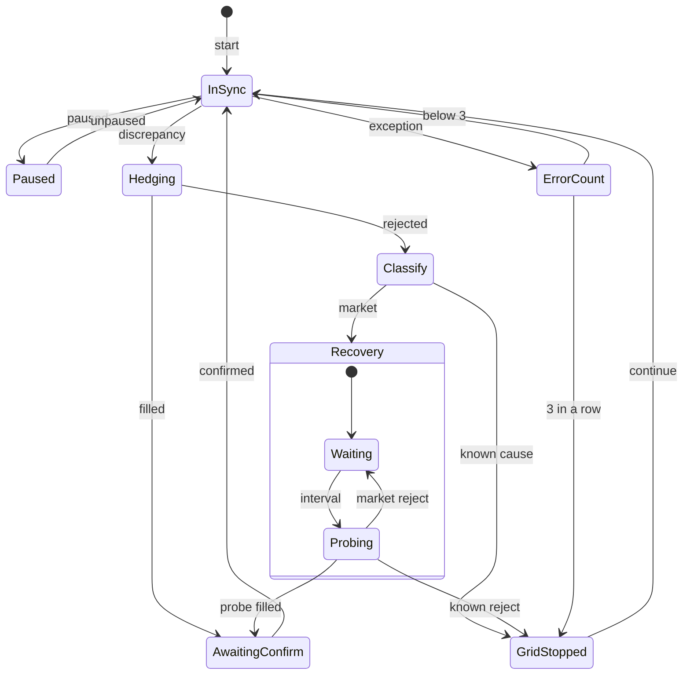
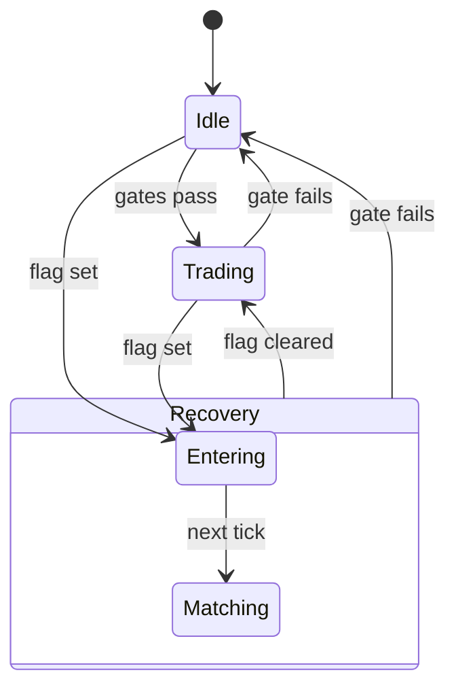
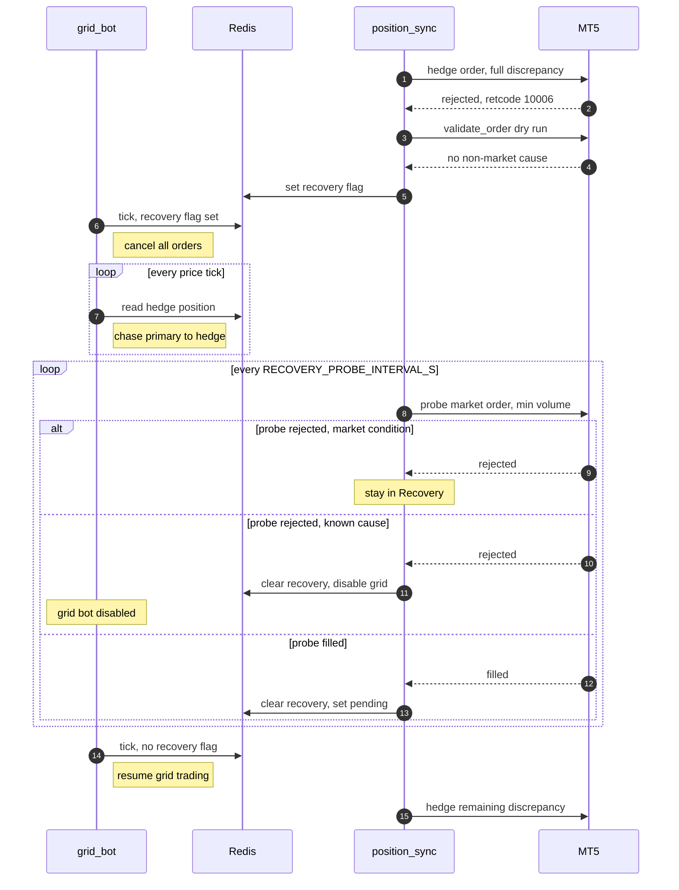

# Grid Bot & Position Sync — State Diagrams

The arbitrage pair runs as two independent loops that only talk to each other
through Redis flags:

- **position_sync** ([position_sync.py](../backend/django/app/quant/algorithms/arbitrage/position_sync.py))
  runs once per primary position update (about every 0.2s). It keeps the MT5
  hedge equal to the primary position by sending MT5 market orders.
- **grid_bot** ([grid_bot.py](../backend/django/app/quant/algorithms/arbitrage/grid_bot.py))
  runs once per price-diff tick. It trades the primary (Binance) with chased
  limit orders according to the grid zones.

**Recovery mode** is shared by both loops. position_sync enters it when an
MT5 hedge order is rejected *only* because of market conditions, such as thin
liquidity. Recovery does not disable the grid bot. The grid bot stops grid
trading and moves the primary to match the hedge. Meanwhile position_sync
probes MT5 with minimum-volume orders until one fills.

## Shared Redis flags

| Flag | Written by | TTL | Meaning |
| --- | --- | --- | --- |
| `grid_bot_enabled_flag` | user (control-api), deleted by position_sync | none | Grid bot is enabled. position_sync deletes it on a failure with a known cause. |
| `position_sync_ok_flag` | position_sync | 2s | Liveness heartbeat. When it is missing, the grid bot does nothing. |
| `sync_pending_flag` | position_sync | 5s | A hedge order is in flight and waiting for MT5 to confirm it. The grid bot places no new orders. |
| `grid_bot_recovery_flag` | position_sync | none | Recovery mode. No TTL, so recovery resumes after a restart. |
| `position_sync_paused_flag` | user (control-api) | none | position_sync ignores all updates. |
| `grid_bot_computed_active_flag` | grid_bot | 5s | Status shown on the dashboard: the grid bot is actually running this tick. |

## Position sync

Each primary position update (about every 0.2s) is one pass through this
machine. Edge labels are kept short so they don't collide when rendered. The
table under the diagram gives the full condition and action for each one.

| Transition | Full condition | Action |
| --- | --- | --- |
| start | position_sync starts | Seed the position group from the live MT5 position. If `grid_bot_recovery_flag` is still set from before a restart, the pass goes straight to `Recovery`. |
| paused / unpaused | `position_sync_paused_flag` set or cleared | All updates are ignored while paused. The ok heartbeat expires, so the grid bot idles. |
| *(stays in `InSync`)* | discrepancy under 1 unit | Refresh the ok heartbeat. |
| discrepancy | discrepancy of 1 unit or more | Send an MT5 market order for the full discrepancy. |
| filled | hedge order filled | Record the fill in the position group and set `sync_pending_flag`. |
| *(stays in `AwaitingConfirm`)* | hedge volume unchanged | Refresh the ok heartbeat and the pending flag. |
| confirmed | MT5 hedge volume changed | Clear `sync_pending_flag`. |
| rejected | hedge order rejected | Classify the failure (see below). |
| market | market-condition failure | Set `grid_bot_recovery_flag` and refresh the ok heartbeat. |
| known cause | any other failure | Delete `grid_bot_enabled_flag` and the ok flag, which disables the grid bot. |
| *(stays in `Waiting`)* | probe interval not elapsed | Refresh the ok heartbeat. No hedging of the discrepancy. |
| interval | `RECOVERY_PROBE_INTERVAL_S` elapsed | Send a minimum-volume probe order. |
| market reject | probe rejected, market condition | Stay in recovery. |
| probe filled | probe filled | Clear `grid_bot_recovery_flag` and set `sync_pending_flag`. |
| known reject | probe rejected, known cause | Clear `grid_bot_recovery_flag` and disable the grid bot. |
| continue | after the grid bot is disabled | position_sync keeps syncing on later updates. |
| exception / below 3 / 3 in a row | exception while processing | Count consecutive errors. On the 3rd in a row, disable the grid bot. |
| *(pass skipped)* | MT5 hedge position can't be read (`PositionsUnavailable`) | Do nothing: no order, no heartbeat, and no error count. The grid bot idles once the ok flag lapses and resumes when MT5 answers again. A failed read is never treated as a flat hedge. |

### What counts as a market condition

A rejected order goes to `Recovery` only if **every** check below passes.
Anything else goes to `GridStopped`, which is the behaviour from before
recovery mode existed.

1. **Inside the trading session.** Outside the session is a known cause.
2. **MT5 retcode is a market-condition code.** These are REQUOTE `10004`,
   REJECT `10006`, DONE_PARTIAL `10010`, TIMEOUT `10012`, INVALID_PRICE `10015`,
   PRICE_CHANGED `10020` and PRICE_OFF `10021`. Transport errors with no
   retcode (MT5 unreachable, HTTP timeout) are *not* market conditions.
3. **A `validate_order` dry run of the same order shows no other cause.** It
   must not report NO_MONEY, MARKET_CLOSED or any other non-market retcode. It
   also must not fail `tick_fresh`, `terminal_connected`,
   `algo_trading_enabled`, `account_trade_allowed` or
   `symbol_trading_enabled`. Failing `order_book_liquidity` or `spread_ok`
   still counts as a market condition.

### Recovery probe

- **Volume:** `minimum_trade_amount / contract_size`, for example 0.01 lot for XAUUSD.
- **Direction:** the probe reduces the outstanding discrepancy if there is one.
  Otherwise it shrinks the hedge position. Either way the grid bot re-matches
  the primary afterwards.
- **What recovery does not do:** position_sync does *not* hedge the full
  discrepancy. The grid bot is closing it from the primary side, and hedging
  would fight it.

## Grid bot

The gates are evaluated again on every price-diff tick, so each tick can move
the bot to a different state. Edge labels are short, and the tables below give
the full conditions and what the bot does in each state.

| Transition | Full condition |
| --- | --- |
| gates pass (`Idle` to `Trading`) | No recovery flag, and all trading gates pass. |
| gate fails (`Trading` to `Idle`) | Any trading gate fails. |
| flag set | `grid_bot_recovery_flag` is set and the recovery gates pass. |
| next tick | The tick after `Entering` has cancelled all open orders. |
| flag cleared | position_sync cleared the flag, and the trading gates pass. |
| gate fails (`Recovery` to `Idle`) | A recovery gate fails while the flag is still set, or the flag clears and a trading gate fails. Examples: the grid bot is disabled, the position_sync heartbeat expired, or the session ended. While the flag is still set, the next tick where the recovery gates pass re-enters at `Entering` via "flag set". |

| State | What happens on each tick |
| --- | --- |
| `Idle` | Nothing is placed or cancelled. The computed active flag is cleared. |
| `Trading` | Aborts on high ATR, multiple open orders or a stale price, cancelling open orders. Otherwise it computes zone, then target, then reconciles. At target, it cancels open orders. With a wrong-side order, it cancels it. With a same-side order, it chases it. With no order: it holds if sync is pending. Otherwise it runs the MT5 hedge check and then places a chase order. |
| `Entering` | Cancels all open grid orders. Places nothing. |
| `Matching` | Target is `-hedge_volume × contract_size`. At target, it cancels leftover orders. An unfit order is cancelled and re-placed next tick. It holds while sync is pending. With no order, it places a chase order with no MT5 hedge check. A fitting order is chased. |

### Gates

- **Trading gates:** grid settings loaded, price diff received,
  `grid_bot_enabled_flag`, `position_sync_ok_flag`, and inside the trading
  session.
- **Recovery gates:** only `grid_bot_enabled_flag`, `position_sync_ok_flag`
  and inside the trading session. Recovery needs no grid settings or price
  diff. The session gate keeps it from colliding with prediction_bot, which
  trades outside the session.
- **Exclusivity:** while `grid_bot_recovery_flag` is set, normal trading never
  runs, even when its gates pass.
- **Recovery target:** `-hedge_volume × contract_size`. In
  `MOCK_ENTRY_POSITION_AMT` mode it is `-hedge_volume`.
- **Unfit order:** a recovery order is cancelled and re-placed next tick when
  its side is wrong, when it is larger than the remaining adjustment, or when
  there is more than one open order.
- **Leaving recovery:** the first tick after the flag clears logs "resuming
  grid trading" and resets `_was_in_recovery`. A recovery gate failing
  mid-recovery also resets it and drops the bot to `Idle`, as if it were not
  in recovery. Either way, the next recovery starts at `Entering` and cancels
  open orders first.

## How the two interact during recovery

