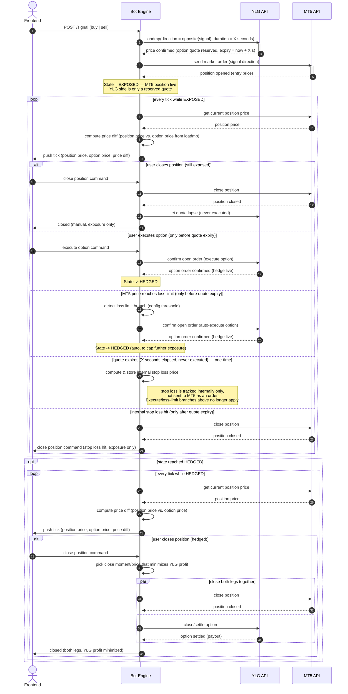

# Option-Hedge Bot — Sequence Diagram

Flow for a bot that opens an MT5 market position on a signal from the frontend,
opens a YLG fixed-time option as a standing offer against it, streams live PnL
back to the frontend, and closes out on manual command, on a configured loss
limit, or on option expiry via an internally tracked stop loss.

The bot moves through two states:

- **EXPOSED** — only the MT5 position is live. The YLG option opened by
  `loadmp` is a reserved quote with a locked price and a running clock, not
  yet a matched trade, so there is no hedge — closing here only touches MT5.
- **HEDGED** — the YLG option has been *executed* (confirmed as an order at
  YLG), so both the MT5 position and the YLG option are live, offsetting
  positions. Closing here must close **both legs at the same time**, at the
  moment/price that **minimizes YLG's profit** on the option leg.

## Notes

- **loadmp** is called against the *opposite* direction of the incoming
  signal with a fixed duration (`X` seconds). A successful `loadmp` call
  opens the fixed-time option as a **reserved quote** — price locked, clock
  running — but that alone is not a matched trade against YLG, so it does
  not create a hedge by itself.
- **State = EXPOSED**: right after the MT5 order fills, only the MT5 side is
  a live risk position. The bot is naked until the option is executed.
- **State = HEDGED**: only reached once the option order is *confirmed* at
  YLG — via a manual "execute option" command, or automatically when the MT5
  loss limit is breached. From this point, MT5 position and YLG option are
  both live, offsetting legs.
- Every tick, the bot pushes three values to the frontend: position price,
  option price, and the diff between them. The option price is never
  re-fetched — it's held from the original `loadmp` response and stays fixed
  for the life of the option (including after expiry).
- **Expiry is a one-time transition within EXPOSED, not a new loop.** Once the
  quote lapses unused, the bot computes an internal stop loss and keeps
  ticking in the same tick loop — the execute/loss-limit branches stop
  applying, and an internal-stop-loss-hit branch becomes reachable instead.
- **Closing differs by state**:
  - While **EXPOSED**, closing (manual command, or the internal stop loss
    firing after the quote expires unused) only touches the MT5 leg — there
    is no YLG position to unwind.
  - While **HEDGED**, closing always unwinds **both legs simultaneously**
    (MT5 position + YLG option), timed at the price/moment that **minimizes
    YLG's profit** on the option leg, since the two legs are now offsetting
    positions and must be torn down together to lock in the hedge's result.
