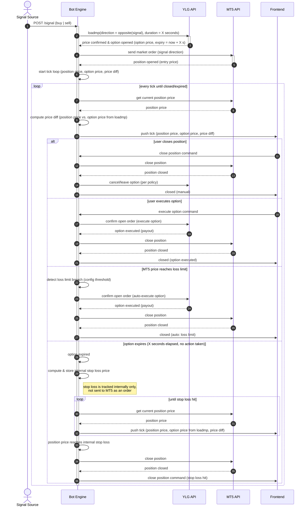

# Option-Hedge Bot — Sequence Diagram

Flow for a bot that opens an MT5 market position on an incoming signal, hedges it
with a YLG fixed-time option, streams live PnL to the frontend, and closes out
either on manual command, on a configured loss limit, or on option expiry via an
internally tracked stop loss.

## Notes

- **loadmp** is called against the *opposite* direction of the incoming signal
  with a fixed duration (`X` seconds). A successful `loadmp` call *is* the
  fixed-time option being opened — there is no separate "open option" step;
  price confirmation and the hedge going live happen in the same call, and
  must complete before the bot fires the MT5 market order.
- The YLG option runs for that fixed duration (`X` seconds) in the opposite
  direction of the MT5 position, acting as a hedge.
- Every tick, the bot pushes three values to the frontend: position price,
  option price, and the diff between them. The option price is never
  re-fetched — it's held from the original `loadmp` response and stays fixed
  for the life of the option (including after expiry).
- Three ways out of a live position/option pair:
  1. **Manual close** — user sends a close position command.
  2. **Manual/auto option execution** — user confirms opening the order at
     YLG (execute option), or the bot does this automatically when the MT5
     price breaches the configured loss limit.
  3. **Option expiry** — if the option expires untouched, the bot computes an
     internal-only stop loss price (never submitted to MT5) and keeps
     streaming ticks until price reaches it, at which point it sends the
     close position command itself.
